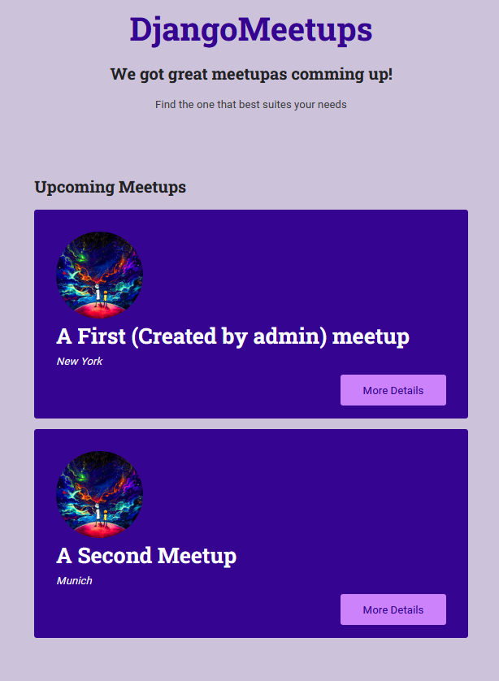
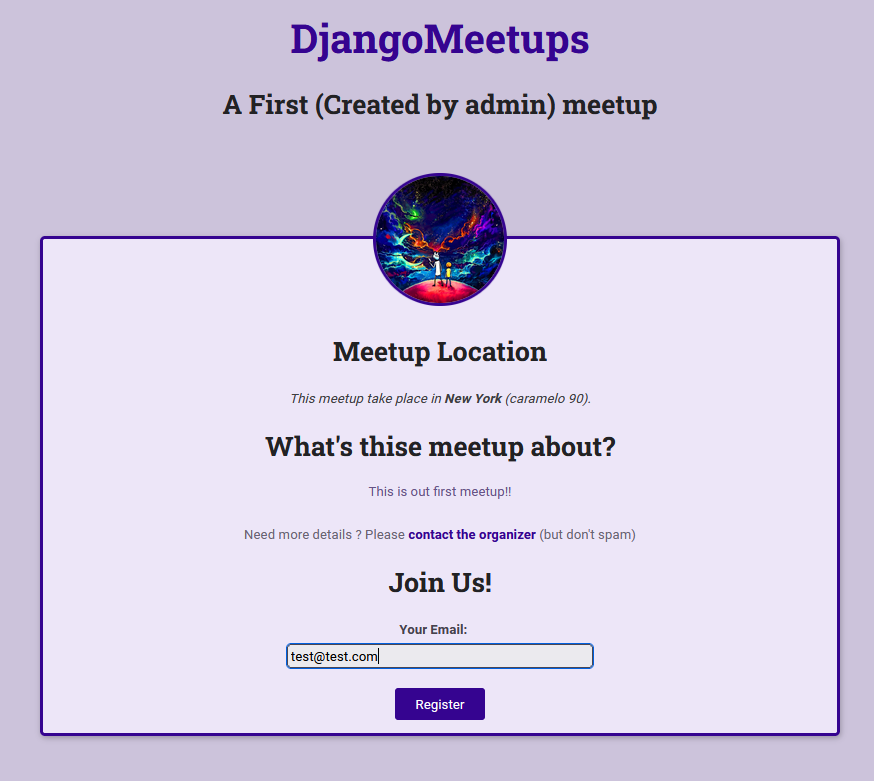
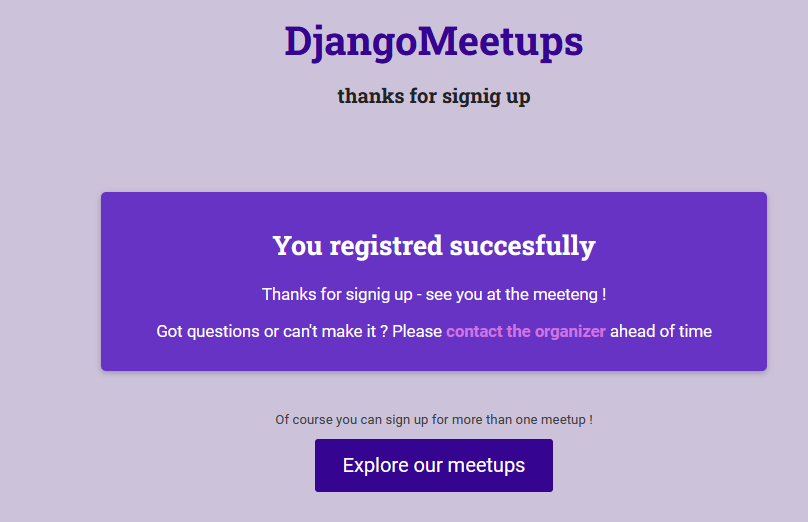
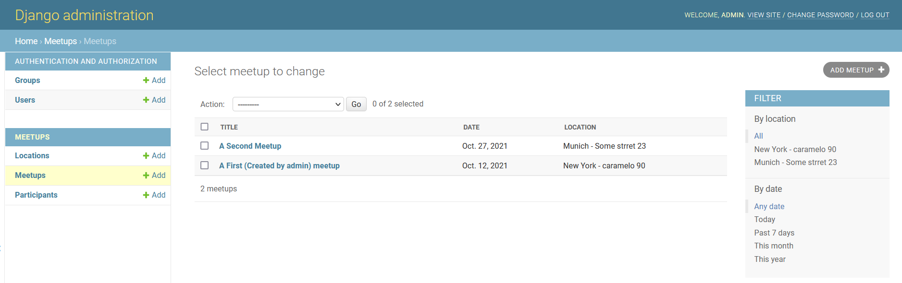

# Django_Tutorial_YT_Academind
Simple web application for meetups using Django

### Description:

Simple web application for meetups using Django

### Necessary libraries:

- Django
- Pillow

### Page overview:

#### Main Page:

#### Meetups Page:

#### Confirmation Page:

#### Admin Page:

